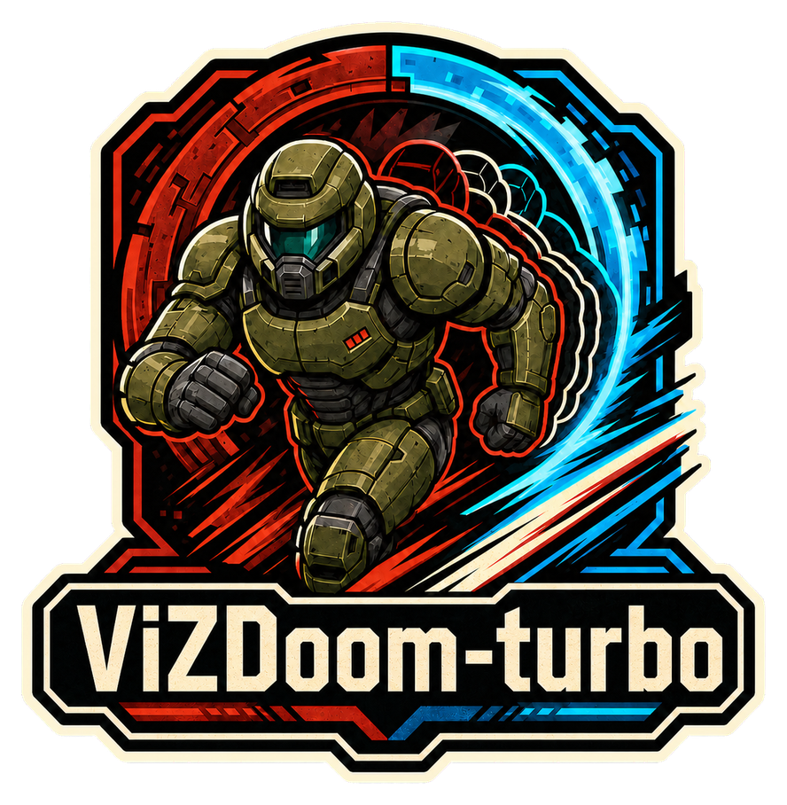

<div align="center">
  
  <br /><br />
  <strong>🚀 Blazing-fast ViZDoom fork with native vectorization and preprocessing 🚀</strong>
  <br /><br />
</div>

`vizdoom-turbo` is a Python library for reinforcement-learning researchers who need fast, parallel ViZDoom environments. It provides a Gymnasium vector environment that can be used directly or selected as an isolated environment provider in `rlab`.

Each vector lane owns an independent `DoomGame`. Lanes advance concurrently through ViZDoom's native API, while a bounded Rust worker pool applies max-pooling, crop, resize, grayscale conversion, frame-stack rotation, and final CHW/HWC layout in one GIL-free native call. Resize geometry and area-sampling tables are compiled once per environment instead of rebuilt per step.

## Install

Install the published package from PyPI:

```bash
uv add vizdoom-turbo
```

To work from source:

```bash
git clone git@github.com:tsilva/ViZDoom-turbo.git
cd ViZDoom-turbo/turbo
uv sync --all-extras
```

Run Python and project commands through `uv run`.

## Use

```python
import gymnasium as gym
import numpy as np

env = gym.make_vec(
    "vizdoom_turbo:Vizdoom-Turbo-v0",
    game="VizdoomBasic-v1",
    num_envs=16,
    num_threads=8,
    obs_resize=(84, 84),
    obs_grayscale=True,
    obs_layout="chw",
    frame_skip=4,
    frame_stack=4,
    use_restricted_actions="minimal",
)

try:
    observations, infos = env.reset(seed=7)
    actions = np.zeros(env.num_envs, dtype=np.int64)
    observations, rewards, terminated, truncated, infos = env.step(actions)

    done = terminated | truncated
    if np.any(done):
        observations, infos = env.reset(
            options={
                "reset_mask": done,
                "state_indices": np.zeros(env.num_envs, dtype=np.int32),
            }
        )
finally:
    env.close()
```

The module-qualified ID imports the package and registers the factory. This ID
is vector-only and requires an explicit `game`, which can be a canonical
registered `Vizdoom...` Gymnasium ID or a ViZDoom `.cfg` path.
`VizdoomTurboVecEnv` remains available for direct use, and the existing
scenario-specific vector IDs remain registered for compatibility.

### Crop or mask observations

The crop API matches the other turbo environments: `obs_crop` contains raw
screen edges in `(top, bottom, left, right)` order. `obs_crop_mode="remove"`
removes those edges before resize; `obs_crop_mode="mask"` preserves the raw
geometry and replaces them with `obs_crop_fill` before resize.

For the classic 320×240 Doom HUD, enable it in ViZDoom and mask its bottom 32
pixels out of policy observations with:

```python
env = VizdoomTurboVecEnv(
    "VizdoomBasic-v1",
    vizdoom_config={"render_hud": True},
    obs_crop=(0, 32, 0, 0),
    obs_crop_mode="mask",
    obs_crop_fill=0,
)
```

The canonical 84×84 grayscale profile performs crop removal and masking
directly in the indexed native pipeline.

### Frame-aligned info histories

Pass `info_frame_stack_keys` to request policy-transition histories whose depth
always matches the resolved `frame_stack`:

```python
env = VizdoomTurboVecEnv(
    "VizdoomBasic-v1",
    frame_skip=4,
    frame_stack=4,
    game_variables=["HEALTH", "ARMOR", "AMMO2", "SELECTED_WEAPON"],
    info_filter={
        "mode": "all",
        "keys": ["health", "armor", "ammo2", "selected_weapon"],
    },
    info_frame_stack_keys=["health", "armor", "ammo2", "selected_weapon"],
)
```

The current fields remain unchanged (`infos["health"]` and
`infos["_health"]`). The opt-in history adds
`infos["health_frame_stack"]` with shape `(num_envs, frame_stack)` and
`infos["_health_frame_stack"]` with shape `(num_envs,)`; non-scalar signals
retain their trailing shape after the history axis. Histories are ordered
oldest-to-newest, repeat the reset value, shift once per vector-environment
`step()` regardless of `frame_skip`, and follow masked-reset, terminal, and live
snapshot semantics lane by lane. They are policy-transition histories, not raw
ViZDoom-tic histories.

## Turbo Vector API v2

`VizdoomTurboVecEnv` implements the strict Turbo Vector API v2:

- `metadata["turbo_api_version"]` is `2`,
  `metadata["transition_transport"]` is `"numpy"`, and `metadata["render_modes"]`
  advertises `rgb_array`.
- Immutable `capabilities` and `signal_schema` declarations describe supported
  features and the dtype, shape, and reset/step availability of every signal.
  `capabilities["supports_info_frame_stack"]` advertises opt-in aligned info
  histories, and each generated history has shape
  `(frame_stack, *original_shape)` in `signal_schema`.
- `buttons`, `action_mode`, `action_preset`, `action_table`,
  `action_meanings`, and `action_table_hash` expose the resolved action
  semantics without provider-specific probing.
- `state_catalog` is an immutable ordered tuple. Callers select reset states
  with an `int32` `state_indices` array and inspect the read-only active indices
  with `active_state_indices()`; state sampling and lane routing remain
  caller-owned.
- `observation_ownership` and `observation_buffer_depth` declare the exact
  lifetime of returned observations. Rendering is opt-in: with
  `render_mode="rgb_array"`, `render_lane(index)` renders one lane,
  `get_images()` renders all lanes, and `render()` renders lane zero. With the
  default `render_mode=None`, the first two methods return `None` and
  `get_images()` returns one `None` entry per lane.

## Use with rlab

Install this distribution in the `rlab` runtime, then select its provider:

```yaml
environment:
  env_provider: vizdoom-turbo
  env_config:
    game: VizdoomBasic-v1
    state: default
    n_envs: 16
    env_args:
      num_threads: 8
      use_restricted_actions: minimal
      obs_grayscale: true
      obs_layout: chw
      frame_stack: 4
    preprocessing:
      frame_skip: 4
      max_pool_frames: true
      observation_size: 84
      obs_resize_algorithm: area
    task:
      id: identity
      action: {set: native}
      signals: {}
      events: {}
      termination: {}
      reward: {reward_mode: native}
```

## Commands

```bash
uv sync --all-extras                                      # install project and dev dependencies
uv run pytest -q                                          # run Python and live-environment tests
uv run ruff check .                                       # lint Python
cargo fmt --check                                         # check Rust formatting
cargo clippy --all-targets --all-features -- -D warnings  # lint Rust
uv build --wheel                                          # build the distributable wheel
```

Install [TurboBench 1.0.0](https://pypi.org/project/turbobench-cli/1.0.0/):

```bash
uv tool install \
  --exclude-newer-package turbobench-cli=2026-08-12T00:00:00Z \
  turbobench-cli==1.0.0
```

Use its immutable `vizdoom/basic-v1` profile for correctness-gated throughput
comparisons. The repository-local `benchmarks/compare_contract.py` remains
available for focused deterministic trace checks.

## Notes

- Python 3.11–3.14 is supported. Source builds require Rust 1.85 or newer.
- ViZDoom 1.3.0 supplies built-in scenarios and Freedoom assets. Commercial Doom IWADs are not included; pass one with `rom_path` when required.
- Autoreset is disabled. Terminal lanes retain their final observation and must be selected explicitly with a masked reset.
- Preprocessing supports crop removal or masking, max-pooling, nearest/bilinear/area resize, grayscale or RGB, frame skip, frame stacking, and CHW or HWC layouts.
- The native vector path supports image observations, `rgb_array` rendering, and one player. Recording is not supported.

## Architecture


## License

The `vizdoom-turbo` additions are [MIT licensed](turbo/LICENSE). ViZDoom and its
ZDoom-derived engine retain their upstream licensing terms.
